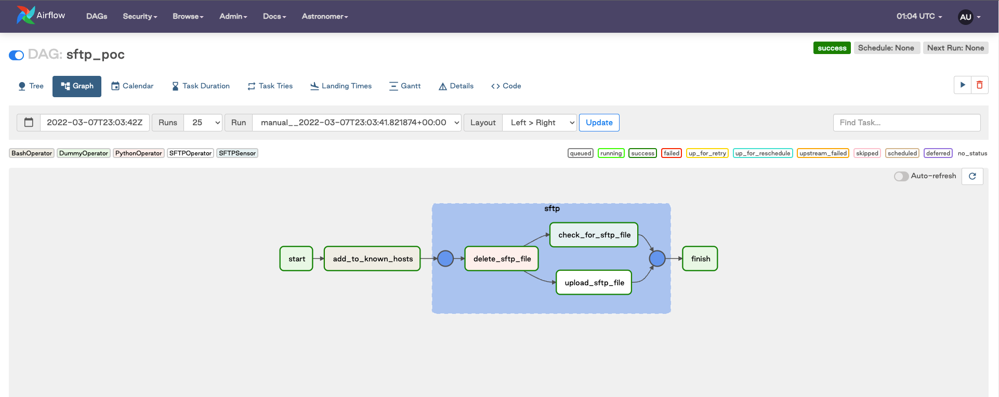

# SFTP - Customer Success Tutorial

>If you follow the steps from this tutorial, you will successfully be able to use the SFTP Modules (click [here](https://registry.astronomer.io/providers/sftp) to view those on the Astronomer Registry) in your Airflow Deployment.

### Prerequisites

- Astronomer CLI:

    - [Astrocloud CLI](https://docs.astronomer.io/astro/install-cli) (For Customers running Astro Product)
    - [Astro CLI](https://docs.astronomer.io/software/cli-quickstart) (For Customers running Software Product)
    
- Creds to a running SFTP Server:

    - Private Key
    - Public RSA Key
    - IP Address
    - Username

### Instructions
*If you are using the Astrocloud CLI, simply replace `astro` in the command(s) below with `astrocloud`*
1. Clone this repo using `git clone git@github.com:astronomer/cs-tutorial-sftp.git`
2. Use the Astro CLI to start a docker sandbox using `cd cs-tutorial-sftp && astro dev start`
3. Once the previous command finishes executing you should be able to navigate to http://localhost:8080/ to view the Airflow UI
4. In the UI, navigate to [connections](http://localhost:8080/connection/list/) and click the edit icon for the `sftp_default` connection
5. Replace the following parameters with the creds from your SFTP Server:

    - Host: `<INSERT YOUR SSH SERVER HOST>` (This can just be an IP address)
    - Username: `<INSERT YOUR SSH SERVER LOGIN>` (Username that you use to SSH onto the Server)
    - Private Key (Extra): `<INSERT-YOUR-ESCAPED-PRIVATE-KEY>` (Be sure to escape it!)
    - Host Key (Extra): `<INSERT-YOUR-BASE64-ENCODED-RSA-KEY>` (Be sure to escape it!)
    
**Please note that you will need to escape your private key and host to make it work as an `Extra` field. Click [here](https://www.freeformatter.com/json-escape.html) for a tool that does that for you**

6. Now that you have replaced the connection parameters with the parameters from your SFTP Server, you should update or remove `airflow_settings.yaml` so that your connection doesn't get overwritten when you rebuild your Docker containers
7. In the Airflow UI, navigate to [DAGs](http://localhost:8080/home) and click on the `sftp_poc` DAG.
   
8. If you've setup your connection properly, you should be able to manually trigger this DAG and the tasks should all succeed.
   
___
### About the Tasks
- The `add_to_known_hosts` task adds your SFTP server to the list of `known_hosts` for easier authentication
- The `delete_sftp_file` task uses the [SFTPHook](https://registry.astronomer.io/providers/sftp/modules/sftphook) to delete a file (if it exists) on your SFTP server
- The `check_for_sftp_file` task uses the [SFTPSensor](https://registry.astronomer.io/providers/sftp/modules/sftpsensor) checks if the file you just deleted in the last step exists
- The `upload_sftp_file` task uses the [SFTPOperator](https://registry.astronomer.io/providers/sftp/modules/sftpoperator) to upload the previously deleted file and make the sensor succeed
- The `start` & `finish` tasks are just [DummyOperators](https://registry.astronomer.io/providers/apache-airflow/modules/dummyoperator) for ease of using the UI